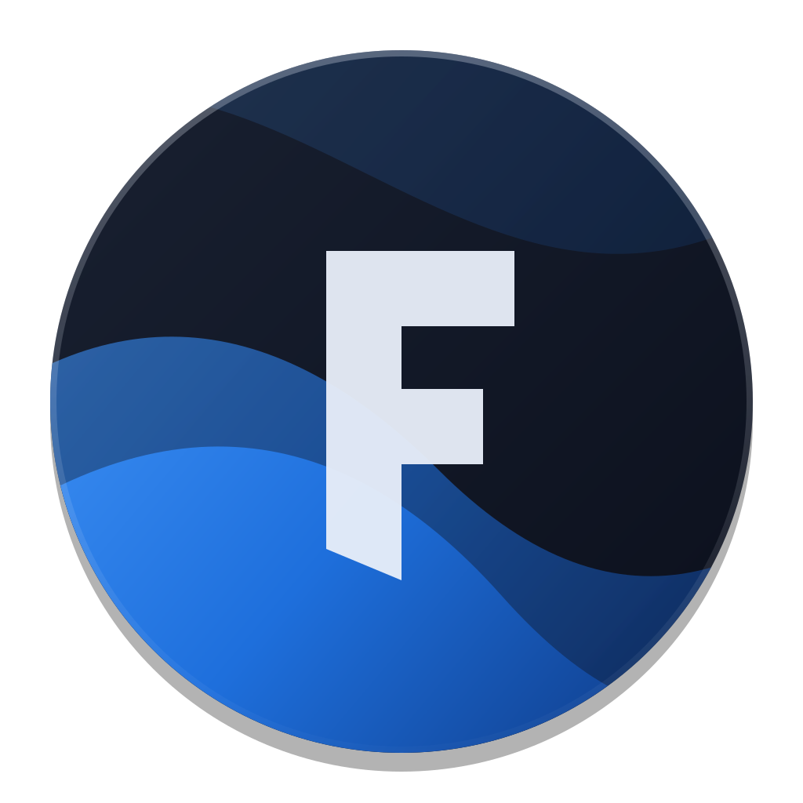
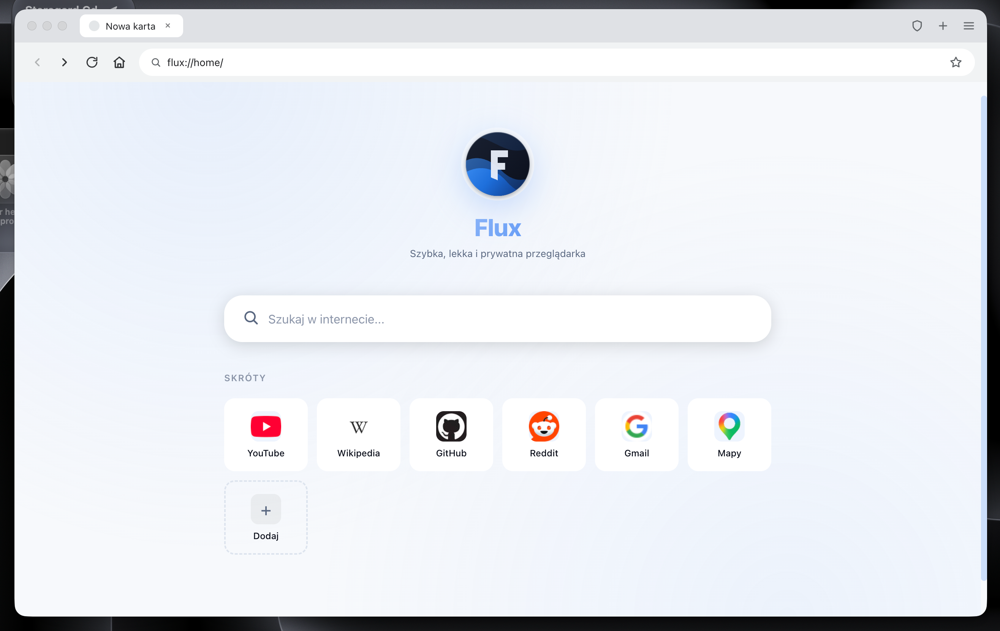
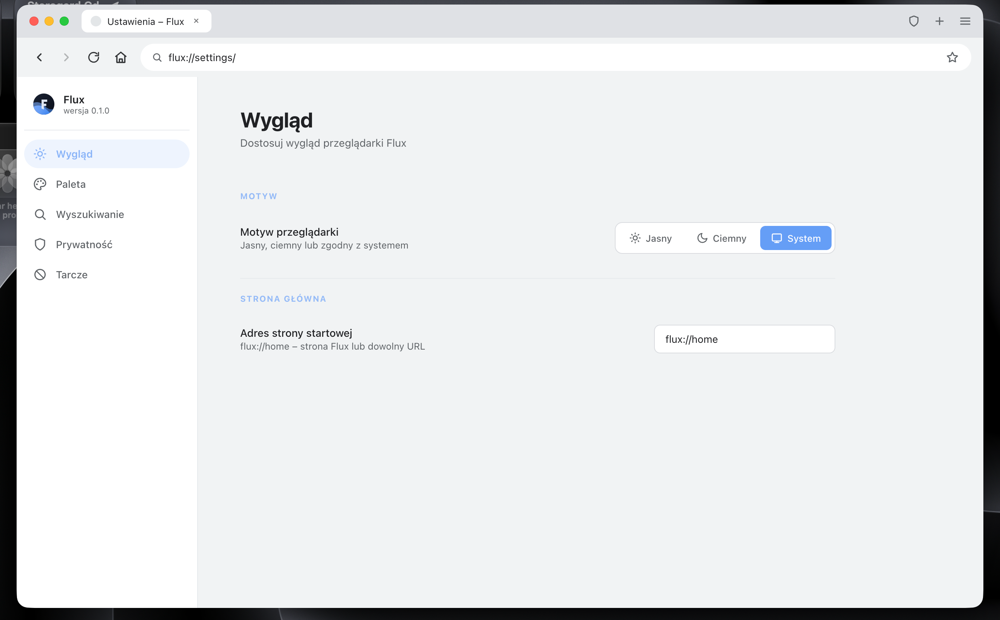
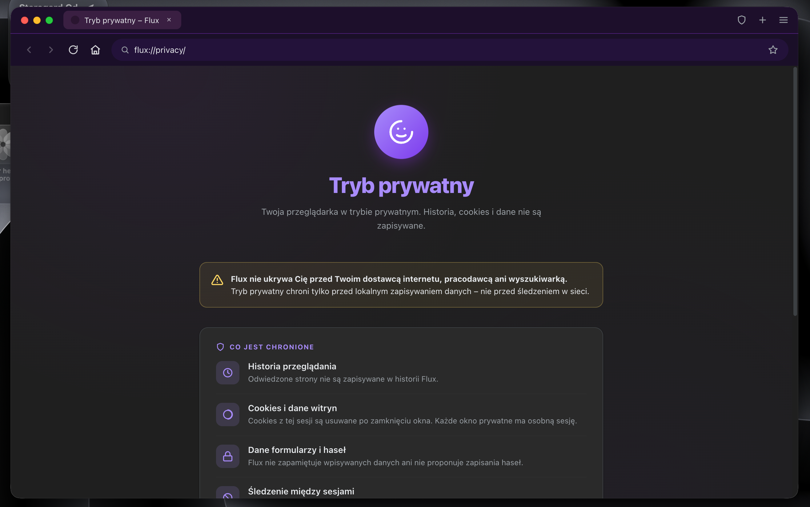
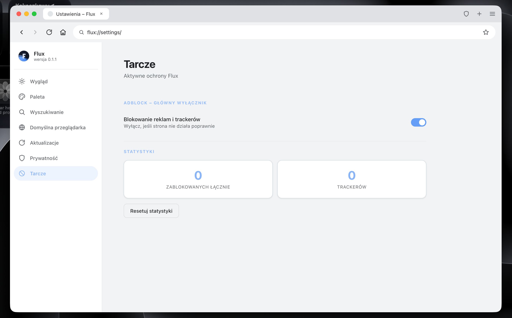

<!-- Banner -->
<div align="center">



# Flux

**Szybka, lekka i prywatna przeglądarka internetowa**

[](https://github.com/kitsun3kage/flux/actions/workflows/deploy.yml)
[](https://github.com/kitsun3kage/flux/releases)
[](LICENSE)
[](https://github.com/kitsun3kage/flux/releases)

[Pobierz](https://github.com/kitsun3kage/flux/releases) •
[Dokumentacja](https://kitsun3kage.github.io) •
[Zgłoś błąd](https://github.com/kitsun3kage/flux/issues)

</div>

---

## ✨ Cechy

<table>
<tr>
<td width="50%">

### 🔒 Prywatność
- **Adblock** – blokuje reklamy i trackery
- **Anti-tracking** – DNT/GPC w każdym żądaniu
- **Anti-fingerprinting** – utrudnia identyfikację
- **Tryb prywatny** – bez historii, cookies i śladów
- **HTTPS tylko** – domyślnie bezpieczne połączenia

</td>
<td width="50%">

### 🎨 Personalizacja
- **7 palet kolorów** – Neutral, Flux Blue, Emerald, Violet, Rose, Amber, Cyan
- **Motyw jasny/ciemny/system** – zgodny z preferencjami
- **Logo zmienia się z paletą** – spójny wygląd
- **Minimalistyczne UI** – inspirowane Chrome
- **Glassmorphism** – efekt szkła w menu

</td>
</tr>
<tr>
<td width="50%">

### 🚀 Wydajność
- **Chromium (Blink)** – ten sam silnik co Chrome
- **Electron** – stabilny framework
- **Szybkie ładowanie** – zoptymalizowany startup
- **Wielokartowość** – pełne wsparcie tabs
- **Zoom** – 50% do 500%

</td>
<td width="50%">

### 📚 Funkcje
- **Wewnętrzne strony** – `flux://home`, `flux://settings`, `flux://history`, `flux://about`, `flux://downloads`, `flux://privacy`
- **Zakładki** – gwiazdka w pasku adresu
- **Historia** – zapisywana lokalnie (max 500 wpisów)
- **Menedżer haseł** – lokalny, bez chmury
- **Eksport/Import** – sync przez JSON

</td>
</tr>
</table>

---

## 📸 Zrzuty ekranu

<table>
<tr>
<td></td>
<td></td>
</tr>
<tr>
<td align="center"><em>Strona startowa</em></td>
<td align="center"><em>Ustawienia</em></td>
</tr>
<tr>
<td></td>
<td></td>
</tr>
<tr>
<td align="center"><em>Tryb prywatny</em></td>
<td align="center"><em>Panel tarczy</em></td>
</tr>
</table>

---

## 📥 Instalacja

### macOS

1. Pobierz plik `.dmg` z [Releases](https://github.com/kitsun3kage/flux/releases)
2. Otwórz DMG i przeciągnij **Flux** do **Applications**
3. **Pierwsze uruchomienie**:
   ```bash
   xattr -cr /Applications/Flux.app
   ```
   Lub kliknij **prawy przycisk → Otwórz** i potwierdź

### Windows

1. Pobierz `Flux-Setup.exe` z [Releases](https://github.com/kitsun3kage/flux/releases)
2. Uruchom instalator
3. Postępuj zgodnie z instrukcjami

**Wersja portable**: `Flux-Portable.exe` – bez instalacji

### Linux

**AppImage** (uniwersalne):
```bash
chmod +x Flux-*.AppImage
./Flux-*.AppImage
```

**Debian/Ubuntu** (.deb):
```bash
sudo dpkg -i Flux-*.deb
flux
```

---

## 🛠️ Budowanie ze źródeł

### Wymagania

- **Node.js** 18+ ([pobierz](https://nodejs.org))
- **npm** 9+ (dołączony do Node.js)
- **Git**

### Kroki

```bash
# 1. Klonuj repozytorium
git clone https://github.com/kitsun3kage/flux.git
cd flux

# 2. Zainstaluj zależności
npm install

# 3. Uruchom w trybie deweloperskim
npm start

# 4. Zbuduj dla swojego systemu
npm run build          # macOS (auto-detekcja arch)
npm run build:win      # Windows (tylko na Windows)
npm run build:linux    # Linux (tylko na Linux)
```

### Ikony

Ikony są **generowane** z `logo.svg`. Aby je odtworzyć:

```bash
# Wymaga: ImageMagick (brew install imagemagick)
# 1. Zrób PNG 1024×1024
qlmanage -t -s 1024 -o . logo.svg
mv logo.svg.png icon-1024.png

# 2. Zrób .icns (macOS)
mkdir icon.iconset
sips -z 16 16     icon-1024.png --out icon.iconset/icon_16x16.png
sips -z 32 32     icon-1024.png --out icon.iconset/icon_16x16@2x.png
# ... (pełna lista w build.sh)
iconutil -c icns icon.iconset -o build/icon.icns
rm -rf icon.iconset

# 3. Zrób .ico (Windows)
convert icon-1024.png -define icon:auto-resize=256,128,64,48,32,24,16 build/icon.ico

# 4. Zrób .png (Linux)
cp icon-1024.png build/icon.png
```

---

## ⌨️ Skróty klawiszowe

| Skrót | Akcja |
|-------|-------|
| `⌘T` / `Ctrl+T` | Nowa karta |
| `⌘N` / `Ctrl+N` | Nowe okno |
| `⌘⇧N` / `Ctrl+Shift+N` | Nowe okno prywatne |
| `⌘W` / `Ctrl+W` | Zamknij kartę |
| `⌘L` / `Ctrl+L` | Fokus na pasek adresu |
| `⌘D` / `Ctrl+D` | Dodaj do zakładek |
| `⌘Y` / `Ctrl+Y` | Historia |
| `⌘J` / `Ctrl+J` | Pobrane |
| `⌘,` / `Ctrl+,` | Ustawienia |
| `⌘+` / `Ctrl++` | Powiększ |
| `⌘-` / `Ctrl+-` | Pomniejsz |
| `⌘0` / `Ctrl+0` | Reset zoomu |
| `F5` / `⌘R` | Odśwież |
| `Esc` | Zamknij menu/modal |

---

## 🔧 Wewnętrzne strony

Flux ma własny protokół `flux://` z wbudowanymi stronami:

| URL | Opis |
|-----|------|
| `flux://home` | Strona startowa z wyszukiwarką i skrótami |
| `flux://settings` | Ustawienia (motyw, paleta, wyszukiwarka, prywatność, adblock) |
| `flux://history` | Historia przeglądania |
| `flux://downloads` | Menedżer pobierania |
| `flux://about` | Informacje o Flux |
| `flux://privacy` | Informacje o trybie prywatnym (tylko w private) |

---

## 🏗️ Struktura projektu

```
flux/
├── .github/
│   └── workflows/
│       └── deploy.yml          # CI/CD dla wszystkich systemów
├── build/
│   ├── icon.icns               # macOS (generowane)
│   ├── icon.ico                # Windows (generowane)
│   ├── icon.png                # Linux (generowane)
│   ├── entitlements.mac.plist  # Uprawnienia macOS
│   └── entitlements.mac.inherit.plist
├── pages/                      # Strony flux://
│   ├── home.html
│   ├── settings.html
│   ├── history.html
│   ├── downloads.html
│   ├── about.html
│   ├── privacy.html
│   └── private-blocked.html
├── main.js                     # Proces główny Electrona
├── renderer.js                 # Logika renderera
├── preload.js                  # Bridge IPC
├── index.html                  # Główny layout
├── style.css                   # Style UI
├── logo.svg                    # Źródło logo
├── blocklist.txt               # Lista adblocków
├── electron-builder.yml        # Konfiguracja builda
├── package.json
├── .gitignore
└── README.md
```

---

## 🔐 Prywatność

Flux **nie zbiera żadnych danych**. Wszystko działa lokalnie:

- Historia – tylko na Twoim urządzeniu (`localStorage`)
- Zakładki – tylko lokalnie
- Hasła – w pliku `flux-passwords.json` w `userData`
- Ustawienia – w pliku `flux-settings.json` w `userData`

**Brak telefonów do domu**, brak telemetrii, brak kont użytkowników.

Adblock używa wbudowanej listy + `blocklist.txt`, którą możesz edytować.

---

## 🤝 Współpraca

Chcesz pomóc? Świetnie!

1. **Fork** repozytorium
2. Stwórz branch: `git checkout -b feature/nazwa`
3. Commituj: `git commit -m "Dodaj X"`
4. Push: `git push origin feature/nazwa`
5. Otwórz **Pull Request**

### Pomysły na rozwój

- [ ] Rozszerzenia (system wtyczek)
- [ ] Synchronizacja między urządzeniami
- [ ] Menedżer haseł z szyfrowaniem AES
- [ ] Integracja z VPN
- [ ] Wsparcie dla profili użytkowników
- [ ] Więcej palet kolorów

---

## 📜 Licencja

MIT License – zobacz [LICENSE](LICENSE)

Możesz używać, modyfikować i dystrybuować bez ograniczeń.

---

## 👤 Autor

**Kitsun3 Kage**

- 🌐 [kitsun3kage.github.io](https://kitsun3kage.github.io)
- 🐙 [@kitsun3kage](https://github.com/kitsun3kage)

---

<div align="center">

**Zbudowane z ❤️ w 2026**

⭐ Jeśli podoba Ci się Flux, daj gwiazdkę!

</div>
